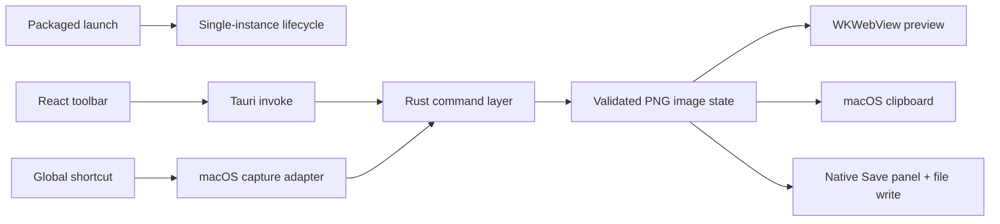

# Shotser Packaged Capture Reliability

## Goal Capsule

- **Objective:** A Mac user can open Shotser once, invoke area capture, complete or cancel selection, and then copy or save the result without an unresponsive interface or duplicate process.
- **Authority:** The user-reported failures and the Product Contract below define the behavior; implementation choices are intentionally left for `ce-plan`.
- **Scope:** Stabilize the packaged Tauri macOS path first; preserve the legacy Swift prototype only as a comparison target.
- **Stop condition:** Do not call the app fixed until a fresh packaged run proves launch, toolbar interaction, capture success, capture cancellation, Copy, Save, and single-instance behavior.

## Product Contract

### Summary

Shotser needs a reliability sprint focused on the path users actually experience: launching the downloadable Mac app, selecting desktop pixels, and completing Copy or Save. The sprint should turn ambiguous “the app is open but nothing works” reports into visible, recoverable states.

### Problem Frame

Previous evaluations found that the legacy app could show a toolbar while refusing physical interaction, and interrupted development runs could leave multiple Shotser processes. The Tauri shell has proven that a packaged WebKit toolbar can load and cross into Rust, but the native interactive selector has only been proven for cancellation, not for a completed drag. A successful capture also needs to be demonstrated as an image artifact rather than inferred from a command return.

### Requirements

- R1. A clean launch opens exactly one packaged Shotser editor window in the foreground.
- R2. Toolbar controls are visibly enabled or visibly explain why they cannot run; no transparent click targets or dead controls are allowed.
- R3. The configured shortcut and Capture area button enter desktop selection without leaving a stale editor overlay or duplicate process.
- R4. A completed selection returns a validated PNG preview with correct dimensions.
- R5. Escape or native cancellation returns to a responsive editor and clearly reports cancellation.
- R6. Copy places the latest validated capture on the macOS clipboard and reports success or a prerequisite error.
- R7. Save opens the native save panel and writes the latest validated capture to the chosen path, with distinct cancel and failure states.
- R8. Screen Recording, Accessibility, shortcut, and file-system failures are visible, actionable, and do not leave the app hung.
- R9. Development/debug processes are not used as the acceptance target, and the packaged app has a distinct identity from the legacy Swift app.
- R10. Every acceptance run leaves a concise evidence record: process count, UI state, command result, and any image artifact metadata.

### Actors and Key Flows

- F1. **Fresh capture:** User opens the packaged app, presses the custom shortcut or Capture area, drags on any connected display, sees a preview, then clicks Copy or Save.
- F2. **Cancellation recovery:** User starts selection and presses Escape; the selector closes, the editor becomes clickable, and the status says Capture cancelled.
- F3. **Empty-state recovery:** User clicks Copy or Save before capturing; the app explains the missing capture and remains usable.
- F4. **Duplicate-process recovery:** A stale development process exists; the acceptance launcher isolates or terminates only Shotser project processes, opens one packaged app, and verifies the resulting instance.

### Acceptance Examples

- AE1. **Given** no Shotser process, **when** the packaged app is opened, **then** one foreground editor appears and the toolbar is discoverable.
- AE2. **Given** Screen Recording permission, **when** the user completes an area drag, **then** the editor shows a non-empty PNG preview whose dimensions match the selected pixel region.
- AE3. **Given** an active selector, **when** the user cancels, **then** the editor remains clickable and shows `Capture cancelled.`.
- AE4. **Given** a validated capture, **when** the user clicks Copy, **then** a receiving image-capable app can paste an image matching the capture.
- AE5. **Given** a validated capture, **when** the user chooses a path in Save, **then** the saved file is a valid PNG and can be reopened.
- AE6. **Given** no validated capture, **when** the user clicks Copy or Save, **then** no false success is shown and the editor remains responsive.
- AE7. **Given** stale Shotser development processes, **when** the packaged acceptance run starts, **then** unrelated processes remain untouched and exactly one packaged Shotser instance is evaluated.

### Scope Boundaries

In scope: packaged Tauri macOS reliability, one-instance launch, toolbar hit-testing, area selection, cancellation, image validation, clipboard Copy, native Save, permission errors, custom shortcut entry, process cleanup, and evidence artifacts.

Deferred: full annotation parity, OCR/QR, window/fullscreen capture parity, image history, cloud features, iOS, notarization automation, and pixel-perfect proprietary Shottr behavior.

### Outstanding Questions

- Q1 (deferred): Should the final native capture adapter use ScreenCaptureKit, CoreGraphics/AppKit, or a Swift plugin after the reliability seam is green?
- Q2 (deferred): Which receiving app should be the canonical manual paste target for acceptance evidence?
- Q3 (deferred): Should a second launch focus the existing editor or show a user-facing “already running” notice?

## Planning Contract

### Key Technical Decisions

- KTD1. **Use the packaged Tauri app as the sole acceptance target.** The legacy Swift app and raw development binaries remain comparison/debug inputs, not competing release surfaces; this directly addresses duplicate-instance ambiguity and the previously unresponsive toolbar.
- KTD2. **Keep one typed command boundary per native operation.** React owns presentation and status state, while Rust owns capture orchestration, clipboard, Save, process/lifecycle coordination, and native error mapping.
- KTD3. **Separate capture from export.** Capture must first produce a validated PNG and canonical image state; Copy and Save consume that state and may never report success when the image is absent or unreadable.
- KTD4. **Treat cancellation and permission denial as normal states.** The selector must be cancellable, and all failure states must return control to an actionable editor.
- KTD5. **Prefer a deterministic harness seam plus one manual physical check.** Accessibility tree/state assertions can prove loading and toolbar behavior; only a real completed desktop drag can prove native area selection end to end.

### High-Level Technical Design

The implementation should expose a capture result with explicit status, optional image data/reference, dimensions, and a safe message. The editor renders a preview only after the result is validated. The adapter choice remains deferred until the seam is proven; the first implementation may wrap the available macOS capture mechanism, with ScreenCaptureKit/CoreGraphics/AppKit or Swift considered if coordinate, permission, or lifecycle behavior requires it.

### Sequencing and Dependencies

U1 establishes the package/lifecycle and typed command seam. U2 depends on U1 and proves capture and cancellation. U3 depends on U2 and owns canonical image state plus Copy/Save. U4 depends on U3 and owns regression evidence, permissions, and release packaging. No later unit may claim successful capture based only on a health-check IPC response.

### Assumptions

- The release target is macOS Apple Silicon; the supplied iOS debugging instructions are not part of this delivery because this repository has no iOS wrapper.
- Screen Recording permission can be granted on the local Mac, but denial must remain testable.
- Local ad-hoc signing is acceptable for evaluation; Developer ID signing and notarization are separate release work.
- The isolated Git metadata in `.shoteye-git` is the repository history used by implementation and review.

## Implementation Units

### U1. Packaged lifecycle and interaction seam

**Goal:** Ensure a fresh packaged launch produces one foreground, accessible, responsive Tauri editor.

**Requirements:** R1, R2, R9, R10; AE1, AE7.

**Dependencies:** None.

**Files:** `tauri-app/src-tauri/tauri.conf.json`, `tauri-app/src-tauri/src/lib.rs`, `tauri-app/src/App.tsx`, `tauri-app/src/App.css`, `tauri-app/src-tauri/capabilities/default.json`, and a packaged interaction harness under `tauri-app/`.

**Approach:**

1. Preserve the unique bundle identifier and local signing configuration.
2. Focus or reuse the existing editor window on launch and prevent competing packaged windows.
3. Make every toolbar control an explicit button with a visible status result.
4. Keep stale-process cleanup limited to exact Shotser project paths in the acceptance launcher.

**Patterns to follow:** Current Tauri accessibility tree, existing Rust `editor_action` seam, and `artifacts/tauri-e2e/` evidence layout.

**Test scenarios:**

- Fresh packaged launch exposes the editor title, toolbar controls, and status text.
- A second launch does not create a second editor instance.
- All toolbar buttons are discoverable and clickable through the packaged app.
- Stale Tauri development processes are isolated from unrelated applications.

**Verification:** One packaged process is active, the editor is accessible, and all controls produce observable results.

### U2. Native area capture and cancellation

**Goal:** Convert a completed desktop selection into a validated PNG and recover cleanly from cancellation or permission denial.

**Requirements:** R3, R4, R5, R8; AE2, AE3.

**Dependencies:** U1.

**Files:** `tauri-app/src-tauri/src/lib.rs`, capture modules under `tauri-app/src-tauri/src/` as needed, `tauri-app/src/App.tsx`, and native-capture tests/fixtures.

**Approach:**

1. Invoke the macOS area selector through one Rust command.
2. Remove or isolate stale output before each capture and validate the resulting PNG before updating editor state.
3. Map completion, cancellation, missing output, permission denial, and process errors to distinct result messages.
4. Preserve display-space coordinates and validate secondary-display dimensions.

**Execution note:** Begin with cancellation-first characterization because that path is already reproducible; add the successful physical drag assertion before declaring the unit complete.

**Test scenarios:**

- A completed drag produces a non-empty PNG preview with expected pixel dimensions.
- Escape returns to the editor with `Capture cancelled.` and toolbar input remains usable.
- Screen Recording denial reports an actionable error and does not reuse a stale PNG.
- Secondary-display selection returns the selected display's dimensions.

**Verification:** A successful desktop drag has image-artifact evidence; cancellation and permission paths pass independently.

### U3. Canonical image, Copy, and Save workflow

**Goal:** Make the validated capture usable through Copy and native Save with truthful success/error behavior.

**Requirements:** R4, R6, R7, R8; AE4, AE5, AE6.

**Dependencies:** U2.

**Files:** `tauri-app/src/App.tsx`, `tauri-app/src-tauri/src/lib.rs`, `tauri-app/src-tauri/Cargo.toml`, `tauri-app/src-tauri/capabilities/default.json`, `tauri-app/package.json`, and export integration tests.

**Approach:**

1. Store the latest validated image in one canonical editor state.
2. Copy that state through a Rust-owned macOS clipboard command.
3. Open the native Save panel through the Tauri dialog capability, then let Rust write and validate the selected path.
4. Disable or explain Copy/Save when no image exists; distinguish cancel from failure.

**Test scenarios:**

- Copy of a valid capture succeeds and pastes into a receiving image-capable app.
- Copy without an image reports a prerequisite error without changing editor state.
- Save cancellation returns to the editor with `Save cancelled.`.
- Save success produces a valid PNG at the selected path.
- Save write failure reports an error without false success.

**Verification:** Capture-to-copy and capture-to-save each produce independent artifact evidence from the packaged app.

### U4. Acceptance harness, permissions, and release package

**Goal:** Make the reliability proof repeatable and hand the user one unambiguous downloadable app.

**Requirements:** R1, R2, R8, R9, R10; AE1–AE7.

**Dependencies:** U1, U2, U3.

**Files:** `tauri-app/` packaging scripts, `tauri-app/src-tauri/tauri.conf.json`, `artifacts/tauri-e2e/`, `PRD.md`, `spec.md`, `tasks/kanban.md`, `learnings.md`, `TODO.md`, and `tasks/todo.md`.

**Approach:**

1. Build and ad-hoc sign the arm64 `.app` and DMG.
2. Start each evaluation from a clean exact-path process state.
3. Run accessibility/UI, IPC, capture cancellation, Save cancellation, and artifact validation checks.
4. Run one physical or harness-driven successful drag-selection check and record any automation limitation separately.
5. Keep notarization requirements visible without presenting local ad-hoc signing as public release readiness.

**Test scenarios:**

- Fresh package opens and passes strict signature verification.
- Packaged frontend loads and Rust health/action calls return macOS results.
- Exactly one packaged process is evaluated after stale-process cleanup.
- Capture, Copy, Save, and cancellation states are visible and recoverable.
- Image artifacts have non-zero size, valid PNG headers, and expected dimensions.
- No unrelated processes are terminated by acceptance cleanup.

**Verification:** A release report names the exact app/DMG paths, process count, permission prerequisites, passed checks, and remaining limitations.

## Verification Contract

| Gate | Done signal |
|---|---|
| Frontend | TypeScript/Vite production build completes without errors. |
| Rust | Cargo check/test completes for changed commands and result types. |
| Package | Tauri builds the arm64 `.app` and DMG. |
| Signature | Packaged `.app` passes strict local code-signature verification. |
| UI | Fresh packaged app exposes all toolbar buttons and status output. |
| Capture | Completed drag yields a validated PNG; cancellation and permission denial are safe. |
| Export | Copy reaches the clipboard and Save writes a valid PNG; empty/cancel/error cases are truthful. |
| Lifecycle | One packaged Shotser process remains after launch; stale cleanup is exact-path scoped. |
| Evidence | Reports and artifacts are under `artifacts/tauri-e2e/` with no secrets or debug markers. |

## Definition of Done

- A user can open one packaged Shotser app and use its toolbar without dead clicks or duplicate windows.
- A custom shortcut or Capture area button starts selection, and a completed selection is previewed as a validated PNG.
- Cancellation, permission denial, empty Copy/Save, and Save cancellation leave the editor responsive.
- Copy and Save complete against a real captured image.
- Multi-monitor selection is proven for at least one secondary-display configuration or explicitly blocked by the available test hardware with evidence.
- The packaged arm64 app is signed for local use, with Developer ID/notarization requirements documented separately.
- Targeted frontend, Rust, packaged UI, capture, export, and lifecycle checks pass.
- The final handoff lists visible app, DMG, report, and screenshot/artifact paths.
