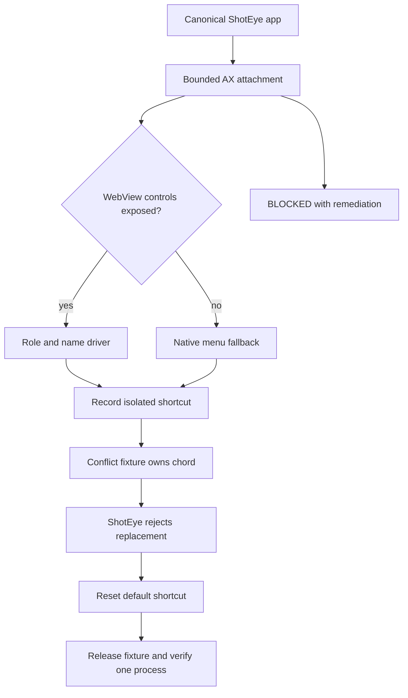

# Stable Accessibility Shortcut Conflict Testing - Plan

## Goal Capsule

- **Objective:** ShotEye's packaged acceptance flow reliably tests shortcut conflicts and leaves the app in a usable state.
- **Means:** Extend the canonical installed-app acceptance pattern with a bounded Accessibility driver, a reversible conflict fixture, and evidence that distinguishes blocked environments from product failures.
- **Authority:** The user request and this plan govern scope; existing ShotEye product behavior and macOS permission safety remain higher-priority constraints than test convenience.
- **Execution profile:** Standard reliability fix with smoke-first verification because the failure crosses Tauri, WebKit Accessibility, macOS global shortcuts, and external processes.
- **Stop conditions:** Stop and report a blocker when the canonical app cannot be attached, Accessibility is unavailable, or macOS refuses the isolated fixture. Do not weaken permissions or mutate unrelated user shortcuts.
- **Tail ownership:** `ce-work` owns implementation, focused verification, review, and the final handoff. No commit or push is implied by this plan.

---

## Product Contract

### Summary

ShotEye currently has a working shortcut registration path, but the physical conflict acceptance path is not dependable. The test harness sometimes sees the WebView controls and sometimes sees only the native window, which makes a real conflict test indistinguishable from an automation failure.

### Problem Frame

The app's shortcut conflict behavior is user-facing reliability behavior. A false green result can hide a stale shortcut, while a false failure can lead to unnecessary changes in capture logic. The acceptance flow must identify the exact installed identity, control the available macOS surface, and clean up every temporary registration.

### Requirements

#### Packaged app attachment

- R1. The acceptance driver attaches only to the canonical installed ShotEye bundle and verifies that one matching application process owns the test.
- R2. The driver waits for a usable application window with bounded retries and reports whether the failure is launch, focus, Accessibility, or WebView exposure.

#### Accessibility control

- R3. The driver locates controls by role and accessible name through the complete Accessibility hierarchy rather than relying on shallow window queries.
- R4. When WebView controls are not exposed, the driver uses the existing native application menus for equivalent reversible actions and records the surface used.

#### Shortcut conflict behavior

- R5. The acceptance flow reserves an isolated test shortcut, asks ShotEye to record the same shortcut, and verifies that ShotEye reports a conflict without replacing its last working shortcut.
- R6. The flow restores ShotEye's default shortcut after the conflict case and verifies that the default remains active.
- R7. Temporary shortcut reservations and helper processes are cleaned up on success, failure, cancellation, and timeout.

#### Evidence and safety

- R8. The report distinguishes `PASS`, `FAIL`, and `BLOCKED` and includes the app identity, surface used, shortcut state, cleanup result, and blocker category.
- R9. The acceptance path must not change macOS privacy settings, remove unrelated shortcuts, create a second ShotEye process, or weaken product permission checks.

### Acceptance Examples

- AE1. **Normal packaged run:** With the installed app and Accessibility available, the driver attaches to one ShotEye process, records a shortcut, and completes the conflict and reset checks.
- AE2. **WebView boundary:** When the WebView does not expose its DOM controls, the driver uses the native menu surface and marks the surface in the report without failing the product test.
- AE3. **Conflict:** When the isolated fixture owns the requested chord, ShotEye keeps its prior active shortcut, reports a conflict, and remains responsive.
- AE4. **Cleanup:** When any step fails or times out, the fixture releases its chord, the app is left with the default shortcut, and no helper process remains.
- AE5. **Missing prerequisite:** When Accessibility or the required fixture capability is unavailable, the run is `BLOCKED` with remediation, not a product failure.

### Success Criteria

- The same installed package produces repeatable conflict and reset results across three consecutive acceptance runs in a stable Accessibility-enabled session.
- Every non-pass result identifies a specific prerequisite or observable product failure without requiring log interpretation.
- No acceptance run leaves a duplicate ShotEye process or an active temporary shortcut reservation.

### Scope Boundaries

#### In scope

- The macOS packaged acceptance harness and its control/fixture helpers.
- Shortcut conflict and reset evidence for the installed ShotEye package.
- Documentation of prerequisite detection and evidence boundaries.

#### Deferred to Follow-Up Work

- Secondary-display physical acceptance.
- Developer ID signing, notarization, and Gatekeeper release validation.
- Alternate keyboard-layout coverage beyond the conflict fixture's stable chord.
- Changes to the product's shortcut registration semantics.

---

## Planning Contract

### Key Technical Decisions

- KTD1. **Drive the canonical installed identity.** Keep the existing single-process and canonical installed-bundle discipline so Accessibility and shortcut evidence refer to the same bundle the user runs.
- KTD2. **Use a layered Accessibility driver.** Prefer direct role/name traversal with bounded polling, then use the existing native-menu fallback when WebView exposure is absent; this preserves product coverage without treating a harness capability boundary as an app defect.
- KTD3. **Isolate the conflict reservation.** Use a short-lived test-owned reservation and deterministic teardown rather than changing system shortcut settings or relying on an unrelated application.
- KTD4. **Separate environment state from product state.** Emit `BLOCKED` for missing Accessibility, display, or fixture prerequisites and reserve `FAIL` for an observed ShotEye behavior that violates the Product Contract.

### High-Level Technical Design

The driver owns bounded attachment and cleanup. The product remains the authority for shortcut registration and status. The fixture owns only its temporary reservation and cannot alter user preferences.

### Assumptions

- The installed package remains the supported acceptance target.
- Accessibility permission can be granted to the test controller outside the harness; the harness must detect its absence without repeatedly retrying indefinitely.
- A global shortcut reservation can be created and released by a short-lived local fixture without changing unrelated system settings.
- Existing shortcut persistence, native-menu, and single-flight patterns remain the product implementation to reuse.

### Risks and Dependencies

- macOS Accessibility may expose different roles across WebKit versions. Mitigate with role/name traversal, native-menu fallback, and surface reporting.
- A fixture reservation may fail because another process owns the chord. Treat this as a fixture prerequisite result and choose a deterministic test chord during implementation.
- A crashed fixture could leave a reservation temporarily active. Mitigate with process-scoped cleanup, timeout handling, and a final ownership check.
- The test controller requires Accessibility authorization. Keep the product path independent from this test-only permission.

### Sources and Research

- Existing packaged harness: `scripts/verify_ui_smoke.sh`.
- Existing shortcut registration behavior: `tauri-app/src/App.tsx`, `tauri-app/src/capture-shortcut.ts`, `tauri-app/src/shortcut-persistence.ts`, and the corresponding tests.
- Existing package identity and process safeguards: `scripts/install_app.sh`, `scripts/test_canonical_launch.sh`, and `scripts/verify_app.sh`.
- Existing native-menu model: `tauri-app/src/menu-model.ts` and `tauri-app/src/App.tsx`.

No external research was required. The repository already contains direct patterns for package identity, native-menu fallback, shortcut persistence, and fail-closed acceptance.

---

## Implementation Units

### U1. Canonical Accessibility attachment and surface discovery

- **Goal:** Make the acceptance driver attach to one installed ShotEye process and classify the usable control surface.
- **Requirements:** R1, R2, R3, R4, R9.
- **Dependencies:** None.
- **Files:** `scripts/verify_ui_smoke.sh`, `scripts/shoteye_ax_driver.swift`, and `artifacts/tauri-e2e/` report fixtures.
- **Approach:**
  1. Reuse canonical bundle and exact-process checks.
  2. Add bounded attachment polling with explicit launch, focus, and Accessibility outcomes.
  3. Traverse the complete AX hierarchy for role/name matches.
  4. Retain the native-menu fallback for equivalent reversible controls.
- **Execution note:** Start with characterization coverage for the current WebView-exposed and native-menu paths before changing the driver.
- **Patterns to follow:** Existing exact-process matching, nested `entire contents` traversal, and fail-closed `BLOCKED` reports.
- **Test Scenarios:**
  - The canonical installed app has one process and an accessible window; the driver finds the shortcut control and reports the selected surface.
  - The WebView exposes only native controls; the driver completes reversible actions through the native menu and records that fallback.
  - A second ShotEye process or build-tree bundle is present; the driver stops before interaction and reports the identity failure.
  - Accessibility access is unavailable; the driver returns `BLOCKED` with remediation and does not loop indefinitely.
- **Verification:** The driver consistently classifies direct-AX, native-menu fallback, duplicate-process, and unavailable-Accessibility states.

### U2. Isolated shortcut-conflict fixture

- **Goal:** Provide a reversible owner for the test shortcut so conflict behavior is exercised against a real registration boundary.
- **Requirements:** R5, R7, R9.
- **Dependencies:** U1.
- **Files:** `scripts/shortcut_conflict_fixture.swift`, `scripts/test_shortcut_conflict_fixture.sh`, and `scripts/verify_ui_smoke.sh`.
- **Approach:**
  1. Select a deterministic modifier-plus-key chord that is safe to reserve temporarily.
  2. Register it in a short-lived fixture process with an explicit release path.
  3. Detect fixture ownership and timeout states without changing unrelated macOS preferences.
  4. Release the reservation on every harness exit path and verify the fixture process is gone.
- **Patterns to follow:** Existing bounded child-process timeouts, exact-process cleanup, and fail-closed native command handling.
- **Test Scenarios:**
  - The fixture reserves an unused chord and reports ownership.
  - The fixture cannot reserve the chord; the acceptance run reports a prerequisite block without claiming a ShotEye conflict.
  - The fixture receives termination or timeout; cleanup releases the reservation and leaves no process.
  - Repeated fixture start/stop cycles do not accumulate registrations or stale processes.
- **Verification:** The fixture can reserve, prove ownership, release, and prove release without changing unrelated shortcut settings.

### U3. Packaged conflict and default-reset acceptance

- **Goal:** Verify the user-visible conflict and recovery behavior through the stable control driver.
- **Requirements:** R5, R6, R8.
- **Dependencies:** U1, U2.
- **Files:** `scripts/verify_ui_smoke.sh`, `scripts/test_accessibility_shortcut_conflict.sh`, and `artifacts/tauri-e2e/` reports.
- **Approach:**
  1. Attach to the installed ShotEye package and record the active shortcut.
  2. Start the isolated fixture and ask ShotEye to record the same chord.
  3. Assert the conflict state, preserved prior binding, and responsive editor.
  4. Release the fixture, reset the default shortcut, and verify active state.
- **Execution note:** Run the packaged smoke path before any unit-level refactor so the evidence boundary stays visible.
- **Patterns to follow:** Existing shortcut acceptance report format, native-menu dispatch, shortcut persistence recovery, and one-process assertions.
- **Test Scenarios:**
  - A valid fixture-owned chord is recorded; ShotEye reports a conflict and keeps its prior working binding.
  - Rapid repeated record/reset actions are issued; the app serializes registration and ends with one active default binding.
  - The conflict step is interrupted; the fixture is released and ShotEye remains usable.
  - The native menu is used because WebView controls are hidden; the same conflict and reset assertions pass with the surface noted.
- **Verification:** Three consecutive packaged runs produce the expected conflict, preservation, reset, cleanup, and process results.

### U4. Evidence and operational documentation

- **Goal:** Make shortcut acceptance results actionable and prevent future false claims.
- **Requirements:** R8, R9.
- **Dependencies:** U1, U2, U3.
- **Files:** `scripts/verify_ui_smoke.sh`, `README.md`, `TODO.md`, `PRD.md`, `spec.md`, `tasks/kanban.md`, `tasks/todo.md`, `learnings.md`, `tasks/lessons.md`, and `artifacts/tauri-e2e/`.
- **Approach:**
  1. Record app identity, surface, active/requested shortcut, fixture ownership, cleanup, and outcome category.
  2. Keep blocked prerequisite guidance separate from product failures.
  3. Document the stable acceptance boundary and remaining external gates.
- **Test Scenarios:**
  - A passing run contains all required identity, surface, shortcut, and cleanup fields.
  - A blocked Accessibility run contains remediation and no misleading product failure.
  - A fixture failure contains the fixture reason and no false ShotEye conflict claim.
  - Generated reports and screenshots remain non-empty and have valid file signatures where applicable.
- **Verification:** Reports and project documentation agree on the acceptance contract and remaining release gates.

---

## Verification Contract

| Gate | Applies to | Pass condition |
| --- | --- | --- |
| Frontend regression | U1, U3 | Focused shortcut/menu/App tests pass; full frontend suite remains green. |
| Rust regression | U2, U3 | Shortcut registration, timeout, cleanup, and command-boundary tests pass. |
| Static checks | U1-U4 | TypeScript build, Rust check, shell syntax, and whitespace checks pass. |
| Packaged smoke | U1, U3 | Exact installed package launches with one process and one native titlebar. |
| Accessibility acceptance | U1, U3 | Direct AX or native-menu fallback drives the conflict and reset flow three times. |
| Fixture cleanup | U2, U3 | No temporary fixture process or registration remains after pass, failure, or timeout. |
| Evidence review | U4 | Reports classify PASS/FAIL/BLOCKED and link observable artifacts. |

The implementation should use the repository's focused frontend and Rust test entry points, the existing packaged UI smoke harness, strict package verification, and shell/static checks. Do not expand verification into unrelated network suites.

---

## Definition of Done

- R1-R9 are implemented or explicitly reported as externally blocked.
- The packaged acceptance harness reliably distinguishes direct AX, native-menu fallback, product conflict failure, and missing prerequisite states.
- A real isolated shortcut reservation proves ShotEye conflict handling and is always released.
- ShotEye preserves its last working shortcut after conflict and returns to the default shortcut after reset.
- Three consecutive stable packaged acceptance runs pass without duplicate processes or leaked fixture state.
- Focused frontend, Rust, build, package, and static checks pass.
- Reports and documentation are updated with evidence paths and honest release boundaries.
- Abandoned experimental helpers and dead-end driver code are removed before handoff.
