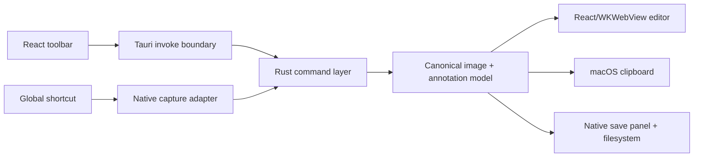

# Shotser Tauri macOS Product Plan

## Goal Capsule

- **Objective:** A Mac user can invoke one shortcut, select an area on any connected display, annotate the result, and reliably copy or save it without an unresponsive window or duplicate app instance.
- **Means:** Use Tauri 2 with a React/WKWebView editor and Rust-owned macOS capture, clipboard, file-dialog, lifecycle, and shortcut adapters (KTD1).
- **Authority:** User-confirmed behavior and this Product Contract govern; current repository conventions govern file placement and verification; implementation details remain open where this plan defers them.
- **Execution profile:** Build vertical slices with a failing user-facing seam first, then add the smallest implementation and independent packaged-app regression.
- **Stop conditions:** Do not claim capture success from compilation alone; stop at a clear permission or automation boundary and record the exact observable result.
- **Tail ownership:** The implementer owns code, targeted tests, packaging, review, and the final handoff; public notarization remains outside local execution unless credentials are supplied.

## Product Contract

### Summary

Shotser is a lightweight macOS screenshot and annotation utility inspired by Shottr's fast toolbar workflow. The primary job is turning a selected desktop region into a useful image in one short interaction.

### Problem Frame

The existing Swift prototype has repeatedly appeared onscreen while failing to accept toolbar clicks, hotkeys, or capture input. Interrupted development launches also left multiple Shotser processes, making it unclear which build the user was operating. A separately identified Tauri bundle now provides an observable frontend-to-Rust seam, but the product needs a complete native capture workflow and disciplined packaging/lifecycle behavior.

### Requirements

- R1. The packaged app opens as one foreground editor instance and remains responsive to mouse and keyboard input.
- R2. A configurable global shortcut starts area selection without requiring the editor toolbar to be focused.
- R3. Area selection works across multiple connected displays and uses the display-space coordinates of the selected region.
- R4. The user can cancel selection and return to an actionable editor without a crash, hang, or stale overlay.
- R5. A successful capture is visible in the editor and retains enough image data for subsequent actions.
- R6. Copy places the latest capture on the macOS clipboard and reports success or a useful prerequisite error.
- R7. Save opens a native file panel, writes the selected image to the chosen location, and reports cancel/error/success states.
- R8. Rectangle and arrow annotations render over the capture and are included in copied and saved output.
- R9. Text, freehand draw, color, zoom, and image-size controls have visible state and do not intercept unrelated editor clicks.
- R10. Open-image and clipboard-image import produce the same editor image model as a new capture.
- R11. Repeat-last-capture reuses the last successful capture mode and does not silently invoke an empty state.
- R12. The app exposes keyboard shortcuts for capture, repeat, open, clipboard import, copy, save, OCR, and escape/cancel, with conflict/error feedback.
- R13. Screen Recording, Accessibility, and any required Input Monitoring permission failures are explained in-app or in a first-run guidance surface.
- R14. Development processes and packaged processes are distinguishable; normal launch does not create competing editor instances.
- R15. The app emits structured, redacted diagnostics at frontend-to-Rust, Rust-to-native, capture, clipboard, save, and lifecycle boundaries.

### Actors and Key Flow

- F1. **Capture to copy:** User presses the configured shortcut, selects a region, sees it in the editor, clicks Copy, and pastes the image into another application.
- F2. **Capture to save:** User presses the shortcut, selects a region, clicks Save, chooses a destination, and finds a valid PNG at that location.
- F3. **Annotate:** User opens or captures an image, selects Rectangle or Arrow, draws a shape, and copies/saves the composited result.
- F4. **Recover:** User cancels selection, denies permission, invokes Copy/Save with no image, or opens an invalid file and receives a recoverable status without an unresponsive UI.
- F5. **Repeat:** User invokes repeat after a successful capture and receives a new capture using the last selected mode.

### Acceptance Examples

- AE1. **Given** a clean launch, **when** the user inspects the editor and clicks each visible toolbar action, **then** each action has a visible state change or an explicit prerequisite/error message.
- AE2. **Given** Screen Recording permission, **when** the user invokes area capture and completes a drag on display 1 or display 2, **then** the selected pixels appear in the editor with correct dimensions.
- AE3. **Given** an active selection, **when** the user presses Escape, **then** the selection closes and the editor remains clickable.
- AE4. **Given** a captured image, **when** the user clicks Copy and pastes into a known image-capable target, **then** the pasted content matches the capture dimensions and annotations.
- AE5. **Given** a captured image, **when** the user saves it to a chosen PNG path, **then** the file exists, is a valid PNG, and can be reopened by Shotser.
- AE6. **Given** no capture, **when** the user invokes Copy or Save, **then** the app reports the missing-capture condition without opening a misleading success state.
- AE7. **Given** an interrupted development run, **when** the packaged app is opened, **then** only one packaged Shotser instance is active and its toolbar is accessible.

### Scope Boundaries

In scope: macOS Apple Silicon desktop packaging, Tauri 2, React/WKWebView editor, Rust commands, native macOS capture/clipboard/save/shortcut integration, multi-monitor coordinates, annotations, image import, repeat capture, permission guidance, diagnostics, and packaged regression testing.

Deferred: iOS/iPadOS targets, notarization credentials and release automation, OCR/QR parity beyond the existing prototype, cloud sync, accounts, billing, team sharing, video capture, and a pixel-perfect clone of Shottr's proprietary implementation.

### Outstanding Questions

- Q1 (deferred): Should capture use a Rust-native macOS API implementation or a small Swift/AppKit plugin once the subprocess-backed vertical slice is stable?
- Q2 (blocking for release polish): Which default shortcut should ship if `⌘⇧2` conflicts with another installed tool?
- Q3 (deferred): Should Save preserve PNG only or offer JPEG/PDF/WebP after the core PNG workflow is reliable?

### Sources and Research

- The repository's current product and workflow documents: `README.md`, `PRD.md`, `spec.md`, `TODO.md`, `tasks/todo.md`, and `learnings.md`.
- Tauri official prerequisites document: https://v2.tauri.app/start/prerequisites/. It distinguishes macOS desktop prerequisites from additional iOS targets and confirms the Rust/Node/WebKit development layers.
- Tauri official macOS bundle document: https://v2.tauri.app/distribute/macos-application-bundle/. It defines the `.app` layout and bundle configuration surface.
- Tauri official macOS signing document: https://v2.tauri.app/distribute/sign/macos/. It documents the `signingIdentity: "-"` ad-hoc local path and the separate need for authenticated signing/notarization for distribution.
- Shottr public product site: https://shottr.cc/. Its toolbar-oriented workflow and release notes informed the emphasis on fast capture, Copy/Save feedback, hotkey activation, and avoiding frozen or duplicate instances.

External research is load-bearing for KTD1, packaging/signing boundaries, and the choice to keep iOS out of this macOS delivery plan.

## Planning Contract

### Key Technical Decisions

- KTD1. **Tauri is the active desktop shell.** Keep the legacy Swift prototype available for comparison, but use the uniquely identified Tauri `.app` as the product delivery path so WebKit, Rust IPC, and native behavior can be tested independently.
- KTD2. **Native capabilities cross one explicit command boundary.** React owns presentation and transient editor state; Rust owns capture orchestration, filesystem writes, clipboard operations, lifecycle guards, and structured result types; native Swift/AppKit is introduced only where Rust cannot provide a stable macOS API.
- KTD3. **Capture data has one canonical image model.** New captures, opened files, and clipboard images normalize into the same PNG-backed editor model with dimensions, source mode, and annotation layer metadata.
- KTD4. **Cancellation and permissions are first-class outcomes.** Commands return typed success/cancel/error results; the UI never treats a missing output file or denied permission as success.
- KTD5. **Package before acceptance.** Development mode is for fast feedback only. The acceptance target is the signed packaged `.app`, with a unique bundle identifier and no stale development processes.
- KTD6. **Use observable seams.** Each vertical slice must have a testable frontend result, a Rust result, or a file/clipboard artifact. No “it did not crash” criterion is sufficient for capture or save.

### High-Level Design

The first implementation seam should return a typed capture result containing status, image bytes or a temporary-file reference, dimensions, source mode, and a user-safe message. The editor should render the image only after the command confirms that the output exists and is readable. Annotation commands should modify an editor model or render list rather than mutate the original capture bytes until export.

### Sequencing and Dependencies

U1 establishes the shell, lifecycle, command result conventions, and test harness seams. U2 depends on U1 and implements capture. U3 depends on U2 and normalizes imported/captured image state. U4 depends on U3 and adds annotation/export composition. U5 depends on U3/U4 and adds shortcuts, repeat, and import entry points. U6 depends on every prior unit and owns packaged regression, permissions, artifacts, and release readiness.

### Assumptions

- The target is macOS on Apple Silicon; iOS is not part of this release.
- Screen Recording permission is available for the local verification machine, but tests must still cover denial and cancellation.
- The existing isolated repository metadata under `.shoteye-git` remains the source of Git history.
- Public distribution will use a future Developer ID/notarization setup; local ad-hoc signing is sufficient for development acceptance.

## Implementation Units

### U1. Tauri shell, lifecycle, and command contracts

**Goal:** Make the Tauri application a single, identifiable, observable foreground editor with stable typed command results.

**Requirements:** R1, R4, R14, R15.

**Dependencies:** None.

**Files:** `tauri-app/src/App.tsx`, `tauri-app/src/App.css`, `tauri-app/src-tauri/src/lib.rs`, `tauri-app/src-tauri/tauri.conf.json`, `tauri-app/src-tauri/capabilities/default.json`, `tauri-app/package.json`, `tauri-app/src-tauri/Cargo.toml`, and a frontend/Rust seam test location selected during implementation.

**Approach:**

1. Keep the bundle identifier distinct from the legacy Swift app and configure local ad-hoc macOS signing.
2. Define serializable success, cancellation, and error result shapes with safe user messages.
3. Add lifecycle behavior that focuses one editor window and avoids spawning a second editor instance.
4. Keep visible toolbar controls backed by explicit handlers and status output.

**Execution note:** Start with characterization coverage for the currently fragile launch/click behavior and prefer packaged runtime smoke verification over a dev-only check.

**Patterns to follow:** Existing `editor_action` IPC seam, `tauri://localhost` accessibility tree, current `artifacts/tauri-e2e/` evidence directory, and the isolated Git workflow.

**Test scenarios:**

- Clean packaged launch exposes the editor title, toolbar, and status surface.
- Repeated launch attempts do not create competing packaged editor windows.
- Each visible toolbar button produces a visible result or an explicit prerequisite message.
- Rust command failures serialize into a user-safe frontend status without an uncaught rejection.

**Verification:** A fresh packaged `.app` loads, is discoverable through macOS Accessibility, and passes the toolbar interaction regression with exactly one packaged process.

### U2. macOS area-capture adapter

**Goal:** Capture a user-selected desktop region and return a readable image or an explicit cancellation/permission error.

**Requirements:** R2, R3, R4, R5, R13.

**Dependencies:** U1.

**Files:** `tauri-app/src-tauri/src/lib.rs`, capture adapter modules created under `tauri-app/src-tauri/src/` if needed, `tauri-app/src/App.tsx`, and capture seam tests/fixtures.

**Approach:**

1. Invoke the macOS capture mechanism behind one Rust command.
2. Normalize output into PNG bytes or a validated temporary-file reference and include pixel dimensions.
3. Map exit, cancellation, missing-output, and permission cases to distinct result states.
4. Preserve display-space coordinates and validate multi-monitor output dimensions before returning success.

**Technical design:** Directional only: the adapter may begin with the available macOS capture executable for a thin vertical slice, then move to CoreGraphics/ScreenCaptureKit or a Swift/AppKit plugin if subprocess behavior cannot meet coordinate, lifecycle, or latency requirements.

**Patterns to follow:** Current `capture_area` result contract and the existing local Screen Recording smoke capture.

**Test scenarios:**

- A selected region produces a valid PNG with non-zero dimensions.
- A selection cancelled with Escape returns cancellation and leaves the editor responsive.
- Missing Screen Recording permission returns a useful error and does not claim success.
- A capture spanning or occurring on a secondary display returns the expected pixel dimensions.
- A stale temporary output is not reused after a cancelled or failed capture.

**Verification:** Successful physical or harness-driven selection is proven by a valid image artifact and displayed preview; cancellation and permission denial are independently green.

### U3. Canonical image model and import/repeat state

**Goal:** Make captured, opened, and clipboard images interchangeable editor inputs with deterministic repeat behavior.

**Requirements:** R5, R10, R11.

**Dependencies:** U2.

**Files:** `tauri-app/src/App.tsx`, new model modules under `tauri-app/src/`, `tauri-app/src-tauri/src/lib.rs`, and image import/repeat tests.

**Approach:**

1. Define a canonical image record with bytes/reference, dimensions, source mode, and last-successful-capture metadata.
2. Add open-file and clipboard-image commands with validation and safe error results.
3. Store only the state needed for repeat-last-capture and clear it on invalidation.
4. Render an explicit empty, loading, success, and error state for each entry point.

**Test scenarios:**

- Valid PNG/JPEG/TIFF open into the editor with correct dimensions.
- Invalid or non-image files return an error without replacing the current image.
- Clipboard image import succeeds when an image exists and reports a clear empty state otherwise.
- Repeat after a successful area capture invokes the same capture mode; repeat before any success is disabled or explanatory.
- Refresh/relaunch behavior does not fabricate a prior capture when no persisted image is intended.

**Verification:** All three input paths render through the same editor model, and repeat behavior is observable and deterministic.

### U4. Annotation model and export composition

**Goal:** Support Rectangle and Arrow annotations plus the existing text/freehand tool surface and include them in Copy/Save output.

**Requirements:** R8, R9.

**Dependencies:** U3.

**Files:** New annotation modules under `tauri-app/src/`, `tauri-app/src/App.tsx`, `tauri-app/src/App.css`, Rust export helpers under `tauri-app/src-tauri/src/` if compositing is native, and annotation tests.

**Approach:**

1. Represent annotations as normalized image-space geometry independent of window zoom.
2. Render interactive overlays in the editor while retaining the original image.
3. Validate geometry bounds and tool state before export.
4. Composite annotations into a PNG only at Copy/Save or an equivalent explicit export boundary.

**Test scenarios:**

- Rectangle and Arrow can be created, selected, and visibly updated.
- Resizing or zooming the editor preserves image-space annotation placement.
- Degenerate drags are ignored or reported without corrupting the model.
- Copy and Save output contain the expected annotation pixels.
- Escape/cancel exits an in-progress annotation without blocking toolbar input.

**Verification:** A fixture image plus known annotation geometry produces a deterministic exported PNG, and the packaged editor remains clickable after annotation cancellation.

### U5. Clipboard, Save, shortcuts, and permission guidance

**Goal:** Complete the user-facing capture-to-copy/save workflow and make global shortcuts understandable and recoverable.

**Requirements:** R2, R6, R7, R12, R13.

**Dependencies:** U3, U4.

**Files:** `tauri-app/src/App.tsx`, `tauri-app/src/App.css`, `tauri-app/src-tauri/src/lib.rs`, `tauri-app/src-tauri/capabilities/default.json`, shortcut/dialog/clipboard dependencies, and integration tests.

**Approach:**

1. Keep Copy, Save, and capture disabled or explanatory when no canonical image exists.
2. Use the native save panel, then let Rust validate and write the chosen path.
3. Add global shortcut registration with conflict and permission errors surfaced in Settings/status UI.
4. Add first-run permission guidance that names Screen Recording, Accessibility, and Input Monitoring separately.
5. Add repeat/open/clipboard/OCR/copy/save keyboard bindings only after each command has a tested target.

**Test scenarios:**

- Copy of a valid capture succeeds and can be pasted as an image.
- Copy with no capture reports a prerequisite error and preserves the editor.
- Save opens, cancels, succeeds to a chosen path, and reports write errors without false success.
- Shortcut registration succeeds, rejects conflicts, and reports denied permission without a dead global state.
- Each shortcut maps to one command and does not trigger duplicate captures.

**Verification:** The packaged app completes capture-to-copy and capture-to-save with artifacts, and permission/cancel/error paths return to a responsive editor.

### U6. Packaged acceptance, diagnostics, and release readiness

**Goal:** Establish a repeatable acceptance harness and a distributable local artifact that does not reproduce the duplicate/unresponsive-app failure.

**Requirements:** R1, R13, R14, R15; AE1–AE7.

**Dependencies:** U1, U2, U3, U4, U5.

**Files:** `tauri-app/src-tauri/tauri.conf.json`, packaging scripts under `tauri-app/`, `artifacts/tauri-e2e/`, `docs/` or repository release notes, and test harness files.

**Approach:**

1. Build the arm64 `.app` and DMG with local ad-hoc signing.
2. Kill only stale processes matching the Shotser project path before a fresh evaluation.
3. Run accessibility discovery, toolbar interaction, capture cancellation, Save cancellation, and artifact checks against the packaged app.
4. Capture at most one representative screenshot and validate all other artifacts through existence, size, format header, and dimensions.
5. Record notarization as an explicit release prerequisite rather than silently treating ad-hoc signing as public distribution.

**Test scenarios:**

- Fresh package opens with valid signature and one packaged process.
- WebKit assets load and the frontend-to-Rust health action returns a macOS result.
- All toolbar actions remain discoverable after a fresh launch.
- Capture cancellation, Save cancellation, and empty Copy are safe and visible.
- Successful capture, copy, save, import, annotation, repeat, and shortcut paths have independent evidence artifacts.
- A simulated stale-development-process condition is cleaned without terminating unrelated applications.

**Verification:** Release acceptance is a packaged-app run with a clear report, artifacts under `artifacts/tauri-e2e/`, valid signature verification, and no untracked debug instrumentation left in production paths.

## Verification Contract

| Gate | Applicability | Done signal |
|---|---|---|
| Frontend build | Every change | TypeScript and Vite production build complete with no errors. |
| Rust check | Every Rust change | Cargo check/test completes with no warnings that affect the touched path. |
| Packaged build | U1–U6 | Tauri produces the arm64 `.app` and DMG. |
| Signature | U1/U6 | The local app passes `codesign --verify --deep --strict`; notarization is separately identified as unavailable without Apple credentials. |
| Accessibility smoke | U1/U6 | Fresh packaged app exposes the editor and visible controls. |
| IPC regression | U1–U5 | Toolbar action produces the expected Rust-backed status or typed error. |
| Native capture | U2/U6 | A successful selection yields a valid PNG artifact; cancellation and permission-denial paths are also verified. |
| Export | U4/U5/U6 | Copy/paste and Save produce valid image artifacts with annotations when applicable. |
| Lifecycle | U1/U6 | Fresh launch leaves one packaged Shotser instance and no stale dev process in the acceptance run. |
| Diagnostics cleanup | U6 | Temporary debug markers and throwaway harnesses are removed or clearly isolated under `artifacts/`. |

The known current baseline is: packaged Tauri loading, toolbar-to-Rust IPC, ad-hoc signing, capture cancellation, Save cancellation, empty Copy, and a macOS fixed-region smoke PNG are proven; successful automated drag-selection and full capture-to-copy/save are not yet proven.

## Definition of Done

- The primary capture-to-copy workflow completes on a real macOS desktop from the packaged Tauri app.
- The capture-to-save workflow completes through the native save panel and produces a valid image file.
- The editor remains clickable after capture, annotation, cancellation, permission denial, and repeated launches.
- Multi-monitor selection, rectangle/arrow annotations, image import, clipboard import, repeat capture, and configured shortcuts have explicit acceptance evidence.
- Empty, loading, success, cancellation, permission, and error states are visible and recoverable.
- The packaged arm64 app has a distinct bundle identifier, valid local signature, and documented Developer ID/notarization requirements.
- Targeted frontend, Rust, integration, and packaged acceptance checks pass; no claim relies solely on compilation or “did not crash.”
- Artifacts and reports are stored under `artifacts/tauri-e2e/` with visible paths in the final handoff.
